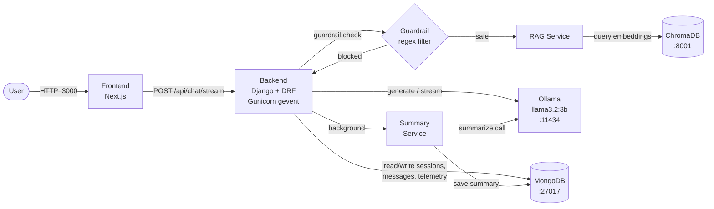

# TeleBot Architecture Document

## 1. System Overview

TeleBot is a containerized conversational support service for Telesur service questions (Mobile, Fiber, Entertainment).

- Frontend: Next.js App Router + Tailwind + Shadcn-style UI components.
- Backend: Django 4.2 + DRF orchestration API.
- Primary persistence: MongoDB (session, message history, summary, telemetry) through `pymongo` repository layer.
- Vector store: ChromaDB for knowledge chunks and semantic retrieval.
- LLM: Ollama local runtime with `llama3.2:3b`.

## 2. Runtime Topology

Docker Compose services:

1. `frontend` (port 3000)
2. `backend` (port 8000)
3. `mongodb` (port 27017)
4. `chromadb` (port 8001 -> 8000 internal)
5. `ollama` (port 11434)

## 3. Request Flow

1. User sends message in frontend chat UI.
2. Frontend posts to `POST /api/chat`.
3. Backend applies guardrail checks.
4. If safe, backend retrieves context from Chroma (`RagService`).
5. Backend injects summary + retrieved context into LLM prompt and calls Ollama.
6. Backend stores user/assistant messages in Mongo.
7. Every 5 stored messages, backend refreshes summary with hidden LLM summarization call.
8. Backend records telemetry entry and returns assistant reply + sources.
9. Tester feedback can be submitted and stored via `POST /api/feedback`.

Request protection:

- DRF scoped throttles enforce rate limits on `/api/chat` and `/api/summarize`.

## 4. Data Flow and Storage

- Mongo collections:
  - `sessions`: session metadata and rolling summary
  - `messages`: conversation history
  - `telemetry`: endpoint performance and errors
  - `feedback`: tester ratings/success notes for user-validation evidence
- Chroma collection:
  - `telesur_docs` with document chunks, metadata, and embeddings

## 5. Key Engineering Choices

- RAG over pure prompt-only chat: improves answer grounding and source attribution.
- Hybrid Mongo approach (`djongo` capability + active `pymongo` repository path): keeps Django compatibility while using performant direct operations for hot paths.
- Local Ollama runtime: avoids external API dependency and supports offline/local deployment.

## 6. Scalability and Risks

- Current implementation is single-instance dev-oriented; horizontal scaling would require shared ingress and stateless app replica coordination.
- Potential bottlenecks:
  - LLM inference latency on local hardware
  - Chroma query latency for larger corpora
  - Mongo Atlas network latency (if remote URI is used)
- Mitigations:
  - Caching frequently asked responses
  - Background ingestion and scheduled reindexing
  - Introduce request queue and rate limiting in production
