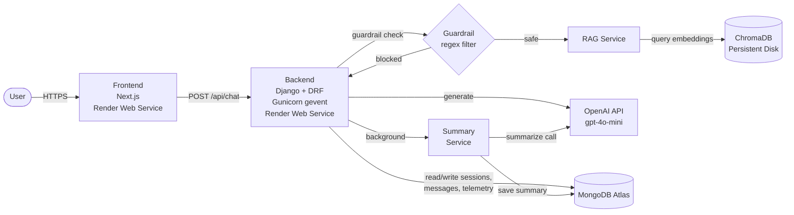

# TeleBot Architecture Document

## 1. System Overview

TeleBot is a production conversational support service for Telesur service questions (Mobile, Fiber, Entertainment), deployed on Render.

- Frontend: Next.js App Router + Tailwind + Shadcn-style UI components, hosted on Render.
- Backend: Django 4.2 + DRF orchestration API, hosted on Render.
- Primary persistence: MongoDB Atlas (session, message history, summary, telemetry) through `pymongo` repository layer.
- Vector store: ChromaDB (persistent disk on Render) for knowledge chunks and semantic retrieval.
- LLM: OpenAI API `gpt-4o-mini` for generation, `text-embedding-3-small` for embeddings.

## 2. Runtime Topology

### Production (Render)

Production services (Render):

1. `telebot-frontend` — Next.js static + SSR (Render Web Service, free tier)
2. `telebot-backend` — Django + Gunicorn (Render Web Service, free tier, 1 GB persistent disk for ChromaDB)
3. MongoDB Atlas — managed cloud database (free tier)
4. OpenAI API — LLM generation and embeddings (external)

### Local Development

For local development, the backend can run with `python manage.py runserver` and the frontend with `npm run dev`. MongoDB can be local or Atlas. See `README.md` for setup instructions.

## 3. Request Flow

1. User sends message in frontend chat UI.
2. Frontend posts to `POST /api/chat`.
3. Backend applies guardrail checks.
4. If safe, backend retrieves context from Chroma (`RagService`).
5. Backend injects summary + retrieved context into LLM prompt and calls Ollama.
6. Backend stores user/assistant messages in Mongo.
7. Every 5 stored messages, backend refreshes summary with hidden LLM summarization call.
8. Backend records telemetry entry and returns assistant reply + sources.
9. Tester feedback can be submitted and stored via `POST /api/feedback`.

Request protection:

- DRF scoped throttles enforce rate limits on `/api/chat` and `/api/summarize`.

## 4. Data Flow and Storage

- Mongo collections:
  - `sessions`: session metadata and rolling summary
  - `messages`: conversation history
  - `telemetry`: endpoint performance and errors
  - `feedback`: tester ratings/success notes for user-validation evidence
- Chroma collection:
  - `telesur_docs` with document chunks, metadata, and embeddings

## 5. Key Engineering Choices

- RAG over pure prompt-only chat: improves answer grounding and source attribution.
- Hybrid Mongo approach (`djongo` capability + active `pymongo` repository path): keeps Django compatibility while using performant direct operations for hot paths.
- OpenAI API (`gpt-4o-mini`): provides high-quality generation and consistent embeddings via `text-embedding-3-small` at low cost. The small model keeps per-token costs minimal while outperforming local alternatives.
- Render hosting: zero-ops deployment with free tier, persistent disk for ChromaDB, and automatic TLS.

## 6. Scalability and Risks

- Current deployment is single-instance on Render free tier; horizontal scaling would require paid plans and stateless app replica coordination.
- Potential bottlenecks:
  - OpenAI API latency and rate limits
  - Chroma query latency for larger corpora
  - MongoDB Atlas network latency
  - Render free tier cold starts (~30s after inactivity)
- Mitigations:
  - Caching frequently asked responses
  - Background ingestion and scheduled reindexing via `build.sh`
  - DRF rate limiting active on chat and summarize endpoints
  - Persistent disk prevents re-ingestion on every deploy
