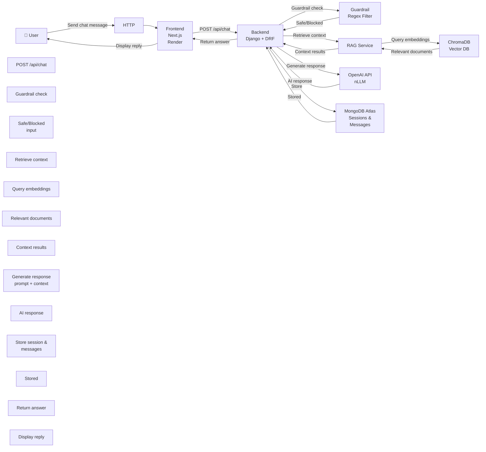
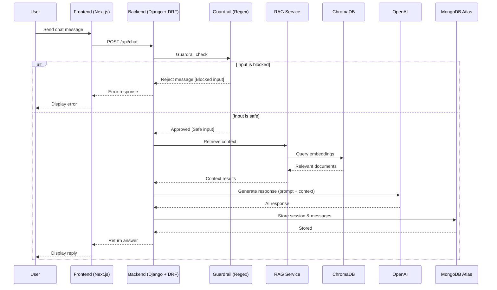

# ARCHITECTUUR VERSLAG

## Projectgegevens

| Item | Details |
|------|---------|
| **Onderdeel** | Architectuur verslag |
| **Opleiding** | Software Engineering |
| **Docent** | Rwynn Christian |
| **Groepsleden** | Amar Sewdas (SE/1123/084) Rushil Ganpat (SE/1123/019) Chen Poun Joe Elton (SE/1123/013) Terrence Linger (SE/1123/037) Shantenoe Bissumbhar (SE/1123/011) |

---

## Voorwoord

Dit document beschrijft het beroepsproduct TeleBot, een AI-gestuurde chatbot die ontwikkeld is voor het beantwoorden van klantvragen binnen een telecomomgeving. Dit verslag is opgesteld in het kader van een schoolopdracht en heeft als doel om de architectuur, technische keuzes en werking van het systeem te documenteren.

Tijdens de ontwikkeling van dit project is gebruikgemaakt van verschillende moderne technologieën, waaronder webframeworks, databases en AI-diensten. Door middel van dit document wordt inzicht gegeven in hoe deze componenten samenwerken om een functionele en schaalbare chatbotoplossing te realiseren.

Het verslag dient als technische beschrijving van het systeem en kan gebruikt worden om de opzet, werking en architectuur van TeleBot beter te begrijpen.

---

## Inhoud

1. [Voorwoord](#voorwoord)
2. [Inleiding](#inleiding)
3. [Doel en Scope](#doel-en-scope)
4. [Architectuurcomponenten](#architectuurcomponenten)
5. [Diagrammen](#diagrammen)
6. [Datastromen](#datastromen)
7. [Afhankelijkheden](#afhankelijkheden)
8. [Onderbouwing van Keuzen](#onderbouwing-van-keuzen)
9. [Schaalbaarheid](#schaalbaarheid)
10. [Globale Kosteninschatting](#globale-kosteninschatting)
11. [Security, Privacy & Betrouwbaarheid](#security-privacy--betrouwbaarheid)
12. [Scalability, Risico's en Beperkingen](#scalability-risicos-en-beperkingen)
13. [Implementatie & Deployment](#implementatie--deployment)

---

## Inleiding

Binnen telecombedrijven zoals Telesur ontvangen klantenservices dagelijks veel vragen over abonnementen, internetinstallaties, storingen en andere diensten. Het handmatig beantwoorden van al deze vragen kan tijd kosten en leiden tot langere wachttijden voor klanten. Om dit proces te ondersteunen kan een chatbot worden ingezet die automatisch veelgestelde vragen kan beantwoorden.

In dit beroepsproduct is TeleBot ontwikkeld: een AI-gebaseerde chatbot die gebruikers helpt bij het verkrijgen van informatie over diensten zoals mobiele abonnementen, fiberinstallaties en entertainmentpakketten. De chatbot is ontworpen met een moderne softwarearchitectuur waarbij een webinterface, backend-API, vector database en een AI-model samenwerken om relevante en contextbewuste antwoorden te genereren.

Dit document beschrijft de architectuur van TeleBot, de gebruikte technologieën en de manier waarop de verschillende systeemcomponenten met elkaar communiceren. Het doel van dit verslag is om een duidelijk technisch overzicht te geven van de opbouw en werking van het systeem.

---

## Doel en Scope

### Doel

Het doel van TeleBot is om klanten van telecomdiensten snel en automatisch te helpen bij vragen over mobiele diensten, fiber internet, storingen en pakketinformatie. In plaats van te moeten wachten op een reactie van de klantenservice (bijvoorbeeld via WhatsApp of e-mail), kunnen gebruikers hun vraag direct aan de chatbot stellen en vrijwel onmiddellijk een antwoord ontvangen.

De chatbot fungeert als een eerste lijn van klantenservice en helpt gebruikers met veelvoorkomende vragen. Hierdoor worden wachttijden verminderd en kunnen klanten sneller geholpen worden zonder direct contact te hoeven opnemen met de klantenservice van Telesur.

### Scope

De scope van dit project omvat de ontwikkeling van een AI-chatbot die in de cloud wordt gehost en toegankelijk is via een webinterface.

Het systeem bestaat uit:
- Een frontend webinterface waar gebruikers vragen kunnen stellen
- Een backend API die gebruikersvragen verwerkt
- Een vector database voor document retrieval
- Integratie met een Large Language Model (LLM) voor het genereren van antwoorden
- Opslag van sessies, berichten en telemetry data
- Monitoring en basis security- en privacymaatregelen

De chatbot wordt volledig gehost in de cloud via Render en is toegankelijk via een webbrowser op zowel desktop als mobiele apparaten. Het systeem is niet bedoeld om lokaal te draaien, maar is ontworpen als een online service die centraal wordt beheerd.

---

## Architectuurcomponenten

### Frontend
- **Next.js 14**
- **Tailwind CSS**
- **Shadcn-style UI components**
- **SSE streaming ondersteuning**

### Backend
- **Django 4.2**
- **Django REST Framework**
- **Gunicorn + gevent**
- **DRF orchestration API**
- **Endpoints:**
  - `/api/chat`
  - `/api/chat/stream`
  - `/api/summarize`
  - `/api/health`
  - `/api/telemetry`
  - `/api/dashboard`

### ChromaDB
- Lokale persistente vectoropslag
- Metadata filtering
- Top-k retrieval

### MongoDB
- Sessies
- Geschiedenis van chatberichten
- Telemetry data
- Gebruikersfeedback

### OpenAI API
- Chat Completions (gpt-4o-mini)
- Embeddings (text-embedding-3-small)

### Deployment
- **Render** (primair)
- **HTTPS** standaard via platform
- **Lokale development** via runserver en npm run dev

---

## Diagrammen

### System Architecture Diagram

### Sequence Diagram - Chat Flow

---

## Datastromen

### Request Flow

- De gebruiker stuurt een bericht via de chatinterface van de frontend.
- De frontend stuurt een verzoek naar POST /api/chat.
- De backend voert guardrail-controles (veiligheidscontroles) uit.
- Als het bericht veilig is, haalt de backend context op uit Chroma (RagService).
- De backend voegt de samenvatting en de opgehaalde context toe aan de LLM-prompt en roept OpenAI API (gpt-4o-mini) aan.
- De backend slaat de berichten van de gebruiker en de assistent op in MongoDB.
- Na elke 5 opgeslagen berichten vernieuwt de backend de samenvatting via een verborgen LLM-samenvattingsoproep.
- De backend registreert een telemetry-record en stuurt het antwoord van de assistent plus de gebruikte bronnen terug.
- Feedback van testers kan worden verzonden en opgeslagen via POST /api/feedback.

### Request Protection

DRF scoped throttles zorgen voor rate limits (snelheidslimieten) op de endpoints `/api/chat` en `/api/summarize`.

### Data Flow & Opslag

#### Mongo Collections:
- **sessions**: sessie metadata en een doorlopende samenvatting
- **messages**: gespreksgeschiedenis
- **telemetry**: endpoint prestaties en fouten
- **feedback**: tester beoordelingen / succesnotities voor user-validation bewijs

#### Chroma Collection:
- **telesur_docs** met documentfragmenten (chunks), metadata en embeddings

---

## Afhankelijkheden

### Runtime
- Python 3.12+
- Node.js 20+

### Externe Services
- OpenAI API
- MongoDB
- ChromaDB

### Configuratie
- .env bestand
- Environment variables voor secrets

### Observability
- `/api/telemetry`
- `/api/dashboard`
- Frontend `/monitor` pagina

---

## Onderbouwing van Keuzen

### 1. RAG (Retrieval-Augmented Generation) boven pure LLM-prompts
Verbetert antwoord tracering (grounding) en brondocumentatie. Gebruikers zien welke Telesur-documenten zijn gebruikt, wat vertrouwen opbouwt en hallucinaties vermindert.

### 2. Hybrid MongoDB-aanpak (djongo functionaliteit + actieve pymongo repository-laag)
Behoudt Django-compatibiliteit terwijl directe, performante bewerkingen worden gebruikt voor kritieke code-paden. Zo krijgen we het beste van beide werelden — Django's stabiliteit plus direct database-performance.

### 3. OpenAI API (gpt-4o-mini)
Levert hoge-kwaliteit antwoorden met consistente embeddings via text-embedding-3-small, tegen lage kosten. Deze small model houdt token-kosten minimaal terwijl deze lokale alternatieven (bijv. Ollama) overtreft in snelheid en kwaliteit.

### 4. Render Hosting
Nul-ops deployment met gratis tier, persistente schijf voor ChromaDB (vector-index overleeft container-restarts), en automatische TLS/HTTPS-certificaten. Geen complexe infrastructure-beheer nodig.

---

## Schaalbaarheid

### Huidige Setup
Geschikt voor development en lichte productie.

### Bottlenecks
- OpenAI API latency
- Vector retrieval performance

### Schaalstrategie
1. Backend stateless maken.
2. Meerdere backend-replicas achter load balancer.
3. Managed vector database bij groei.
4. Caching implementeren voor frequente queries.
5. CDN voor statische frontend assets.

---

## Globale Kosteninschatting

### Kleine Productie
- Render Free: €0
- MongoDB Shared: €0–€9/maand
- OpenAI API (~100 req/dag): €20/maand
- Domein: €1/maand
- **Totaal: €22-30/maand**

### Medium Gebruik
- Render betaald: ~€14/maand
- MongoDB M5: ~€57/maand
- OpenAI API (~1000 req/dag): €50–€100/maand
- **Totaal: ~€121–€171/maand**

---

## Security, Privacy & Betrouwbaarheid

### Security
- Regex guardrails tegen basis prompt-injection en ongepaste input.
- Rate limiting (30 requests/min) op `/api/chat` en `/api/summarize`.
- Secrets via environment variables voor veilige opslag van API-sleutels.
- HTTPS voor veilige communicatie.

### Privacy
- Minimale opslag van PII (persoonlijke gegevens).
- Retentiebeleid voor opgeslagen data.
- Pseudonimisering waar mogelijk.

### Betrouwbaarheid
- `/api/health` endpoint voor systeemstatus.
- Graceful degradation als document retrieval faalt.
- Logging en error tracking voor monitoring.

---

## Scalability, Risico's en Beperkingen

- Applicatie draait momenteel als single instance op Render (free tier).
- Mogelijke bottlenecks: OpenAI API latency, Chroma queries, MongoDB netwerk latency en Render cold starts.
- Rate limiting en caching helpen om overbelasting te voorkomen.
- Regex-guardrails zijn beperkt tegen geavanceerde prompt-injection.
- Afhankelijkheid van OpenAI API uptime.
- Documenten moeten regelmatig worden bijgewerkt voor correcte antwoorden.

---

## Implementatie & Deployment

### Lokaal Starten
1. Clone de repository.
2. Kopieer `.env.example` naar `.env` en stel `OPENAI_API_KEY` en `MONGO_URI` in.
3. Start de backend (dependencies installeren, migrate uitvoeren, server starten).
4. Start de frontend (`npm install` en `npm run dev`).
5. Test via localhost (chat interface en API endpoints).

### Productie (Render)
1. Code pushen naar GitHub.
2. Repository verbinden met Render.
3. Environment variables / secrets configureren.
4. Automatische deployment via `render.yaml`.
5. Render start automatisch de frontend (Next.js) en backend (Django + Gunicorn) services.

### Rollback
1. Render deployment revert naar een vorige versie.
2. Alternatief: Git revert en opnieuw deployen.
3. Database herstel via MongoDB Atlas backups.

---

**Einde van Architectuur Verslag**
