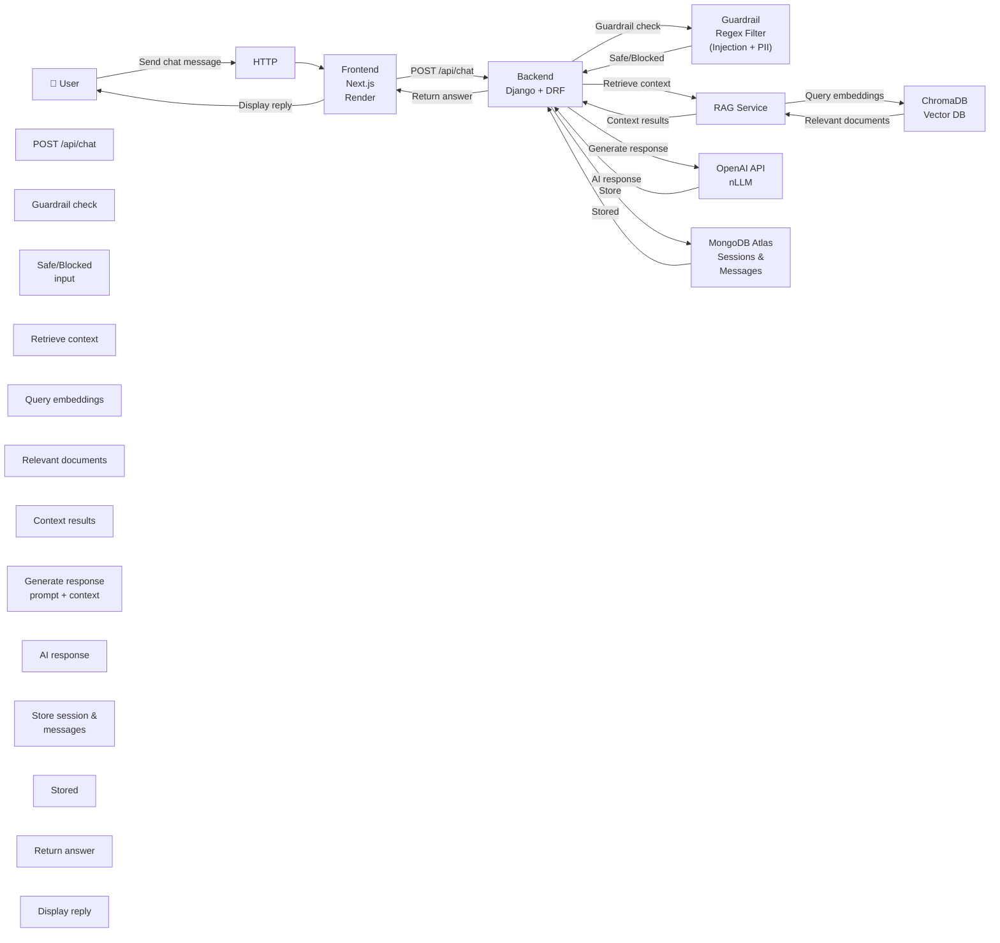
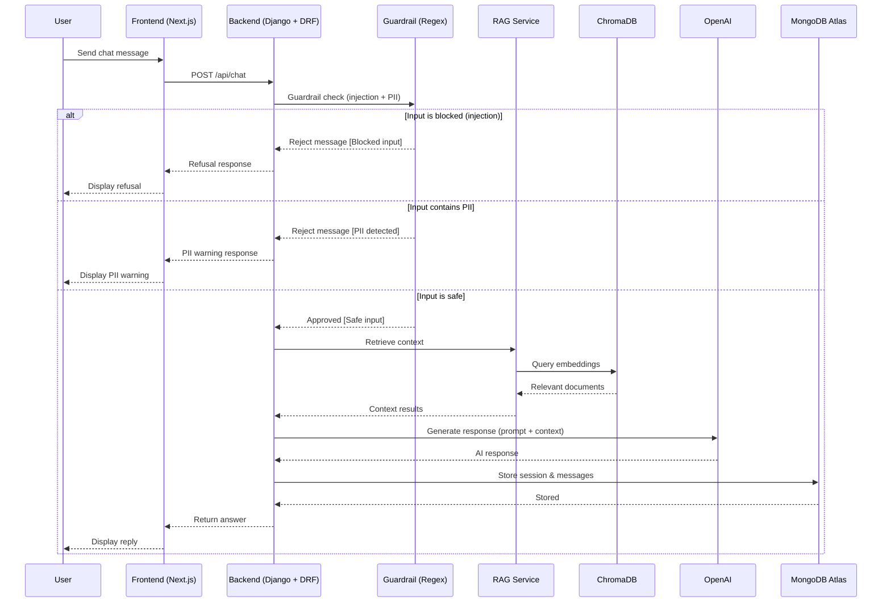

# ARCHITECTUUR VERSLAG

## Projectgegevens

| Item | Details |
|------|---------|
| **Onderdeel** | Architectuur verslag |
| **Opleiding** | Software Engineering |
| **Docent** | Rwynn Christian |
| **Groepsleden** | Amar Sewdas (SE/1123/084)<br/>Rushil Ganpat (SE/1123/019)<br/>Chen Poun Joe Elton (SE/1123/013)<br/>Terrence Linger (SE/1123/037)<br/>Shantenoe Bissumbhar (SE/1123/011) |

---

## Voorwoord

Dit document beschrijft het beroepsproduct TeleBot, een AI-gestuurde chatbot die ontwikkeld is voor het beantwoorden van klantvragen binnen een telecomomgeving. Dit verslag is opgesteld in het kader van een schoolopdracht en heeft als doel om de architectuur, technische keuzes en werking van het systeem te documenteren.

Tijdens de ontwikkeling van dit project is gebruikgemaakt van verschillende moderne technologieën, waaronder webframeworks, databases en AI-diensten. Door middel van dit document wordt inzicht gegeven in hoe deze componenten samenwerken om een functionele en schaalbare chatbotoplossing te realiseren.

Het verslag dient als technische beschrijving van het systeem en kan gebruikt worden om de opzet, werking en architectuur van TeleBot beter te begrijpen.

---

## Inhoud

1. [Voorwoord](#voorwoord)
2. [Inleiding](#inleiding)
3. [Doel en Scope](#doel-en-scope)
4. [Architectuurcomponenten](#architectuurcomponenten)
5. [Diagrammen](#diagrammen)
6. [Datastromen](#datastromen)
7. [Afhankelijkheden](#afhankelijkheden)
8. [Onderbouwing van Keuzen](#onderbouwing-van-keuzen)
9. [Schaalbaarheid](#schaalbaarheid)
10. [Globale Kosteninschatting](#globale-kosteninschatting)
11. [Security, Privacy & Betrouwbaarheid](#security-privacy--betrouwbaarheid)
12. [Scalability, Risico's en Beperkingen](#scalability-risicos-en-beperkingen)
13. [Implementatie & Deployment](#implementatie--deployment)

---

## Inleiding

Binnen telecombedrijven zoals Telesur ontvangen klantenservices dagelijks veel vragen over abonnementen, internetinstallaties, storingen en andere diensten. Het handmatig beantwoorden van al deze vragen kan tijd kosten en leiden tot langere wachttijden voor klanten. Om dit proces te ondersteunen kan een chatbot worden ingezet die automatisch veelgestelde vragen kan beantwoorden.

In dit beroepsproduct is TeleBot ontwikkeld: een AI-gebaseerde chatbot die gebruikers helpt bij het verkrijgen van informatie over diensten zoals mobiele abonnementen, fiberinstallaties en entertainmentpakketten. De chatbot is ontworpen met een moderne softwarearchitectuur waarbij een webinterface, backend-API, vector database en een AI-model samenwerken om relevante en contextbewuste antwoorden te genereren.

Dit document beschrijft de architectuur van TeleBot, de gebruikte technologieën en de manier waarop de verschillende systeemcomponenten met elkaar communiceren. Het doel van dit verslag is om een duidelijk technisch overzicht te geven van de opbouw en werking van het systeem.

---

## Doel en Scope

### Doel

Het doel van TeleBot is om klanten van telecomdiensten snel en automatisch te helpen bij vragen over mobiele diensten, fiber internet, storingen en pakketinformatie. In plaats van te moeten wachten op een reactie van de klantenservice (bijvoorbeeld via WhatsApp of e-mail), kunnen gebruikers hun vraag direct aan de chatbot stellen en vrijwel onmiddellijk een antwoord ontvangen.

De chatbot fungeert als een eerste lijn van klantenservice en helpt gebruikers met veelvoorkomende vragen. Hierdoor worden wachttijden verminderd en kunnen klanten sneller geholpen worden zonder direct contact te hoeven opnemen met de klantenservice van Telesur.

### Scope

De scope van dit project omvat de ontwikkeling van een AI-chatbot die in de cloud wordt gehost en toegankelijk is via een webinterface.

Het systeem bestaat uit:
- Een frontend webinterface waar gebruikers vragen kunnen stellen
- Een backend API die gebruikersvragen verwerkt
- Een vector database voor document retrieval
- Integratie met een Large Language Model (LLM) voor het genereren van antwoorden
- Opslag van sessies, berichten en telemetry data
- Monitoring en basis security- en privacymaatregelen

De chatbot wordt volledig gehost in de cloud via Render en is toegankelijk via een webbrowser op zowel desktop als mobiele apparaten. Het systeem is niet bedoeld om lokaal te draaien, maar is ontworpen als een online service die centraal wordt beheerd.

---

## Architectuurcomponenten

### Frontend
- **Next.js 14**
- **Tailwind CSS**
- **Shadcn-style UI components**
- **SSE streaming ondersteuning**
- **react-markdown** voor geformatteerde chatantwoorden
- **Feedback UI**: thumbs-up / thumbs-down knoppen per chatbericht (POST naar `/api/feedback`)
- **Monitoring dashboard** (`/monitor`): stat-kaarten, kosteninschatting, latency-sparkline en feedback-overzicht

### Backend
- **Django 4.2**
- **Django REST Framework**
- **Gunicorn + gevent**
- **DRF orchestration API**
- **Endpoints:**
  - `/api/chat`
  - `/api/chat/stream`
  - `/api/summarize`
  - `/api/health`
  - `/api/telemetry`
  - `/api/dashboard`
  - `/api/feedback`

### ChromaDB
- Lokale persistente vectoropslag
- Metadata filtering
- Top-k retrieval

### MongoDB
- Sessies
- Geschiedenis van chatberichten
- Telemetry data
- Gebruikersfeedback

### OpenAI API
- Chat Completions (gpt-4o-mini)
- Embeddings (text-embedding-3-small)

### Deployment
- **Render** (primair)
- **HTTPS** standaard via platform
- **Lokale development** via runserver en npm run dev

---

## Diagrammen

### System Architecture Diagram



### Sequence Diagram - Chat Flow



---

## Datastromen

### Request Flow

- De gebruiker stuurt een bericht via de chatinterface van de frontend.
- De frontend stuurt een verzoek naar POST /api/chat.
- De backend voert guardrail-controles uit: eerst prompt-injection detectie (`is_blocked`), daarna PII-detectie (`contains_pii`) voor telefoonnummers, e-mailadressen, BSN-nummers en creditcardnummers.
- Als het bericht veilig is en geen PII bevat, haalt de backend context op uit Chroma (RagService).
- De backend voegt de samenvatting en de opgehaalde context toe aan de LLM-prompt en roept OpenAI API (gpt-4o-mini) aan.
- De backend slaat de berichten van de gebruiker en de assistent op in MongoDB.
- Na elke 5 opgeslagen berichten vernieuwt de backend de samenvatting via een verborgen LLM-samenvattingsoproep.
- De backend registreert een telemetry-record en stuurt het antwoord van de assistent plus de gebruikte bronnen terug.
- Feedback van testers kan worden verzonden en opgeslagen via POST /api/feedback.

### Request Protection

DRF scoped throttles zorgen voor rate limits (snelheidslimieten) op de endpoints `/api/chat` en `/api/summarize`.

### Data Flow & Opslag

#### Mongo Collections:
- **sessions**: sessie metadata en een doorlopende samenvatting
- **messages**: gespreksgeschiedenis
- **telemetry**: endpoint prestaties en fouten
- **feedback**: tester beoordelingen / succesnotities voor user-validation bewijs

#### Chroma Collection:
- **telesur_docs** met documentfragmenten (chunks), metadata en embeddings

---

## Afhankelijkheden

### Runtime
- Python 3.12+
- Node.js 20+

### Externe Services
- OpenAI API
- MongoDB
- ChromaDB

### Configuratie
- .env bestand
- Environment variables voor secrets

### Observability
- `/api/telemetry` — per-request latency, tokens, status
- `/api/dashboard` — geaggregeerde statistieken inclusief tokenkosten (`cost_usd_est`) en feedback-samenvatting
- Frontend `/monitor` pagina met:
  - Stat-kaarten (requests, error rate, latency, tokens, kosten, conversations)
  - Feedback-overzicht (entries, avg rating, success rate)
  - **Latency-sparkline** (kleurgecodeerde staafgrafiek van de laatste 25 requests)
  - Telemetry-logtabel met per-rij kostenkolom

---

## Onderbouwing van Keuzen

### 1. RAG (Retrieval-Augmented Generation) boven pure LLM-prompts
Verbetert antwoord tracering (grounding) en brondocumentatie. Gebruikers zien welke Telesur-documenten zijn gebruikt, wat vertrouwen opbouwt en hallucinaties vermindert.

### 2. Hybrid MongoDB-aanpak (djongo functionaliteit + actieve pymongo repository-laag)
Behoudt Django-compatibiliteit terwijl directe, performante bewerkingen worden gebruikt voor kritieke code-paden. Zo krijgen we het beste van beide werelden — Django's stabiliteit plus direct database-performance.

### 3. OpenAI API (gpt-4o-mini)
Levert hoge-kwaliteit antwoorden met consistente embeddings via text-embedding-3-small, tegen lage kosten. Deze small model houdt token-kosten minimaal terwijl deze lokale alternatieven (bijv. Ollama) overtreft in snelheid en kwaliteit.

### 4. Render Hosting
Nul-ops deployment met gratis tier, persistente schijf voor ChromaDB (vector-index overleeft container-restarts), en automatische TLS/HTTPS-certificaten. Geen complexe infrastructure-beheer nodig.

---

## Schaalbaarheid

### Huidige Setup
Geschikt voor development en lichte productie.

### Bottlenecks
- OpenAI API latency
- Vector retrieval performance

### Schaalstrategie
1. Backend stateless maken.
2. Meerdere backend-replicas achter load balancer.
3. Managed vector database bij groei.
4. Caching implementeren voor frequente queries.
5. CDN voor statische frontend assets.

---

## Globale Kosteninschatting

### Kleine Productie
- Render Free: €0
- MongoDB Shared: €0–€9/maand
- OpenAI API (~100 req/dag): €20/maand
- Domein: €1/maand
- **Totaal: €22-30/maand**

### Medium productie
- Render betaald: ~€14/maand
- MongoDB M5: ~€57/maand
- OpenAI API (~1000 req/dag): €50–€100/maand
- **Totaal: ~€121–€171/maand**

### Grootte productie
- Render (Auto-scaling): ~€300/maand
- MongoDB Dedicated (M30+): ~€400 – €750/maand
- OpenAI API (~100.000 req/dag): €500 (Mini) – €8.500 (Full)/maand
- Infrastructuur (CDN/Mail/Logs): ~€250/maand
- **Totaal: ~€1.450 – €9.800/maand**

---

## Security, Privacy & Betrouwbaarheid

### 1. Prompt Injection Risico's & Beveiliging

TeleBot verwerkt vrije-tekst invoer van onbekende gebruikers. Dit maakt het systeem vatbaar voor prompt-injection aanvallen, waarbij een kwaadwillende gebruiker probeert het systeemgedrag te manipuleren.

**Geïmplementeerde mitigaties:**

- **Regex-guardrail (pre-LLM filter):** Elke gebruikersinvoer wordt vóór de LLM-aanroep gecontroleerd door `GuardrailService`. De service bevat 4 regex-patronen tegen prompt injection (`_blocked_patterns`):
  - `ignore (all) previous/prior instructions` — instruction bypass
  - `reveal (the) system/internal/developer prompt` — prompt exfiltratie
  - `api key / password / token / secret / credential` — credential extractie
  - `bypass safety / jailbreak / override instructions` — guardrail omzeiling
- **PII-detectie guardrail:** Een tweede guardrail (`_pii_patterns`) herkent persoonlijke gegevens zoals BSN-nummers (9-cijferig), telefoonnummers (+597 / 06 / internationaal), e-mailadressen en creditcardnummers. Berichten met PII worden direct geweigerd.
- **Vaste weigeringstekst:** Bij een match wordt een deterministische refusal geretourneerd (bijv. *"I cannot help with requests for secrets, credentials, or instruction bypass attempts."*). Er vindt geen LLM-aanroep plaats.
- **Case-insensitive matching:** Alle patronen werken met `re.IGNORECASE` om variaties te vangen.

**Residueel risico:** Patroongebaseerde guardrails kunnen onbekende, creatieve herformuleringen missen. Aanbeveling voor toekomstige versie: classifier-gebaseerde moderatie (bijv. OpenAI Moderation API) toevoegen als extra laag.

### 2. Misbruikpreventie

| Maatregel | Implementatie | Configuratie |
|---|---|---|
| Rate limiting (chat) | DRF `ScopedRateThrottle` op `/api/chat` | `CHAT_RATE_LIMIT` = 30/min |
| Rate limiting (samenvatting) | DRF `ScopedRateThrottle` op `/api/summarize` | `SUMMARIZE_RATE_LIMIT` = 20/min |
| Rate limiting (feedback) | DRF `ScopedRateThrottle` op `/api/feedback` | `FEEDBACK_RATE_LIMIT` = 30/min |
| Rate limiting (anoniem) | Globale anonieme limiet | `ANON_RATE_LIMIT` = 120/min |
| Inputvalidatie | DRF serializers controleren invoerformaat | Automatisch via Django REST Framework |
| Foutafscherming | Fallback error responses zonder stacktrace | `DEBUG=0` in productie |

Bij overschrijding van rate limits retourneert de API een `HTTP 429 Too Many Requests` response.

**Aanbeveling:** Bij toekomstige authenticatie per-gebruiker quota's toevoegen en reverse-proxy WAF-regels overwegen.

### 3. Persoonsgegevens en AVG (GDPR)

**Dataminimalisatie — huidige maatregelen:**

| Opgeslagen data | Doel | Bevat PII? |
|---|---|---|
| `sessions` (MongoDB) | Sessie-metadata, rolling summary | Nee — sessie-ID is random UUID |
| `messages` (MongoDB) | Gespreksgeschiedenis | Mogelijk — gebruikers kunnen persoonlijke info typen |
| `telemetry` (MongoDB) | Endpoint prestaties, fouten | Nee — alleen operationele metadata |
| `feedback` (MongoDB) | Tester beoordelingen | Nee — tester-ID is pseudoniem |

- **Geen authenticatie:** Er worden geen accounts, e-mailadressen of wachtwoorden opgeslagen.
- **Pseudonimisering:** Sessie-ID's en tester-ID's zijn willekeurige UUID's zonder koppeling aan echte identiteiten.
- **Telemetry bevat geen prompts:** Alleen operationele metadata (latency, tokenaantallen, foutmeldingen) wordt gelogd, niet de volledige promptinhoud.
- **Verwerking door derden:** Gebruikersberichten worden naar de OpenAI API gestuurd voor generatie en embedding. Volgens het OpenAI API-beleid worden API-data niet gebruikt voor modeltraining. Een Data Processing Agreement (DPA) is beschikbaar voor AVG-compliance.

**Vereiste productieacties:**
- Retentiebeleid definiëren voor berichten en telemetry (bijv. automatisch verwijderen na 90 dagen).
- Data-export en verwijderworkflows implementeren (recht op vergetelheid).
- Privacyverklaring opstellen die gebruikers informeert over derde-partij verwerking (OpenAI).

### 4. Secrets Management

- Alle API-sleutels en configuratie via environment variables (`.env` lokaal, Render environment variables in productie).
- `.env` staat in `.gitignore` — geen secrets in versiebeheer.
- Frontend-container ontvangt alleen `NEXT_PUBLIC_API_BASE_URL` — geen backend-secrets worden blootgesteld.
- `SECRET_KEY` wordt automatisch gegenereerd door Render Blueprint (`generateValue: true` in `render.yaml`).
- OpenAI API-sleutel wordt encrypted-at-rest opgeslagen door Render.

### 5. Foutafhandeling en Fallbacks

- **Health endpoint:** `GET /api/health` controleert MongoDB, ChromaDB en OpenAI API status. Retourneert `{"status": "ok"}` met per-service statusmeldingen.
- **Chat fallback:** Het chat-endpoint vangt runtime-exceptions op en retourneert een veilige foutmelding in plaats van een stacktrace.
- **Retrieval degradation:** Als ChromaDB-retrieval faalt, kan het systeem graceful degraderen zonder de hele request te laten crashen.
- **CORS-bescherming:** Alleen geconfigureerde origins (`CORS_ALLOWED_ORIGINS`) mogen de API benaderen. In productie staat `CORS_ALLOW_ALL_ORIGINS` op `0`.
- **HTTPS:** Automatisch TLS-certificaat via Render voor alle productie-endpoints.

---

## Scalability, Risico's en Beperkingen

- Applicatie draait momenteel als single instance op Render (free tier).
- Mogelijke bottlenecks: OpenAI API latency, Chroma queries, MongoDB netwerk latency en Render cold starts.
- Rate limiting en caching helpen om overbelasting te voorkomen.
- Regex-guardrails zijn beperkt tegen geavanceerde prompt-injection.
- Afhankelijkheid van OpenAI API uptime.
- Documenten moeten regelmatig worden bijgewerkt voor correcte antwoorden.

---

## Implementatie & Deployment

### Omgevingen

| Omgeving | Runtime | Doel | Toegang |
|---|---|---|---|
| **Development** | Lokale processen (`runserver` + `npm run dev`) | Feature-ontwikkeling, prompt-iteratie, debugging | `localhost:3000` (frontend), `localhost:8000` (API) |
| **Productie** | Render Web Services (free tier) | Live service voor eindgebruikers | `https://telesur-chatbot.onrender.com` |

### Lokaal Starten

```bash
# 1. Clone de repository
git clone <repo-url>

# 2. Backend opzetten
cd backend
python -m venv venv
source venv/bin/activate          # Mac/Linux
pip install -r requirements.txt

# 3. Environment variables instellen
cp ../env.example ../.env
# Bewerk ../.env en stel OPENAI_API_KEY en MONGO_URI in

# 4. Database migraties uitvoeren
python manage.py migrate --noinput

# 5. RAG data inladen
python scripts/ingest_docs.py --data-dir ../data --reset

# 6. Backend starten
python manage.py runserver

# 7. Frontend starten (nieuwe terminal)
cd frontend
npm install
echo "NEXT_PUBLIC_API_BASE_URL=http://localhost:8000" > .env.local
npm run dev
```

**Validatie na opstart:**
- `GET http://localhost:8000/api/health` → verwacht `{"status": "ok"}`
- `POST http://localhost:8000/api/chat` → verwacht antwoord met bronnen
- Open `http://localhost:3000` → chat interface

### Productie Deployment (Render)

**Optie A: Render Blueprint (Aanbevolen)**

1. Push de repository naar GitHub.
2. In Render Dashboard → **New** → **Blueprint**, verbind de repository. Render detecteert automatisch `render.yaml`.
3. Stel de vereiste environment variables in (zie tabel hieronder).
4. Klik op **Deploy**. Render start automatisch beide services.

**Optie B: Handmatige Setup**

1. Maak een Backend Web Service aan: Runtime=Python, Root=`backend`, Build=`./build.sh`, Start=`gunicorn config.wsgi:application --bind 0.0.0.0:$PORT --worker-class gevent --workers 2 --timeout 180`.
2. Voeg een 1 GB schijf toe op `/opt/render/project/src/chroma_data`.
3. Maak een Frontend Web Service aan: Runtime=Node, Root=`frontend`, Build=`npm ci && npm run build`, Start=`node .next/standalone/server.js`.
4. Stel environment variables in per `render.yaml`.

**Opmerking:** Het `build.sh` script scrapt automatisch de Telesur-website en laadt documenten in ChromaDB bij elke deploy. Render free tier heeft cold starts (~30 seconden) na inactiviteit.

### Configuratiebeheer

Alle runtime-waarden worden aangestuurd via environment variables. Er zijn geen hardcoded secrets in de broncode.

| Variable | Dev (lokaal) | Productie (Render) | Beschrijving |
|---|---|---|---|
| `DEBUG` | `1` (True) | `0` (False) | Django debug-modus |
| `OPENAI_API_KEY` | Via `.env` | Render env var | OpenAI API-sleutel |
| `OPENAI_MODEL` | `gpt-4o-mini` | `gpt-4o-mini` | LLM model |
| `OPENAI_EMBED_MODEL` | `text-embedding-3-small` | `text-embedding-3-small` | Embedding model |
| `MONGO_URI` | Via `.env` | Render env var | MongoDB connectiestring |
| `MONGO_DB_NAME` | `telesur_dev` | `telesur_chatbot` | Database naam |
| `ALLOWED_HOSTS` | `*` | `.onrender.com` | Toegestane hosts |
| `CORS_ALLOWED_ORIGINS` | `http://localhost:3000` | Frontend Render URL | CORS-origins |
| `SECRET_KEY` | Via `.env` | Auto-gegenereerd | Django secret key |

### Versiebeheerstrategie

- **Git** voor alle broncode met GitHub als remote repository.
- **`main` branch** is de productie-branch — Render deployt automatisch bij elke push naar `main`.
- Feature-branches voor nieuwe functionaliteit, samengevoegd via pull requests.
- Tags/releases voor belangrijke versies (bijv. `v1.0.0` voor eindoplevering).

### Updateprocedure

1. Trek de laatste broncode: `git pull origin main`.
2. Controleer wijzigingen in `.env` / `render.yaml`.
3. Push naar GitHub — Render deployt automatisch vanuit de verbonden branch.
4. Monitor de deploy-logs in het Render dashboard.
5. Valideer na deploy: controleer `/api/health` en test chatfunctionaliteit.

Voor handmatige deploys: klik op "Manual Deploy" → "Clear build cache & deploy" in het Render dashboard.

### Rollbackstrategie

1. In het Render dashboard: selecteer een eerdere deploy en klik op **Rollback**.
2. Alternatief: revert naar een eerdere tag/commit in Git en push om een nieuwe deploy te triggeren.
3. Database-herstel indien nodig via MongoDB Atlas backups (automatische dagelijkse backups op Atlas).
4. Valideer na rollback: controleer `/api/health` en test chatgedrag.

### Beheer en Verantwoordelijkheden

| Rol | Verantwoordelijkheid |
|---|---|
| **Development team** | Code, prompts, RAG-pipeline, deployments |
| **Data-eigenaar** | Service-documentatie in `/data` bijhouden |
| **Operationeel beheer** | Telemetry monitoren, container health bewaken |

---

## Monitoring & Evaluatie

### 1. Gelogde Metrics

Elke request naar `/api/chat` slaat de volgende telemetry op in MongoDB:

| Metric | Beschrijving |
|---|---|
| `endpoint` | Aangesproken API-endpoint |
| `ttft_ms` | Responstijd (time to first token, in milliseconden) |
| `total_tokens_est` | Geschat totaal aantal tokens (input + output) |
| `status` | `ok` of `error` |
| `error_message` | Foutmelding indien van toepassing |
| `created_at` | Timestamp van het verzoek |

Niet-chat endpoints worden ook gelogd via de `ApiTelemetryMiddleware` voor latency- en erroroverzicht.

### 2. Monitoring Endpoints

| Endpoint | Retourneert |
|---|---|
| `GET /api/health` | Status van MongoDB, ChromaDB en OpenAI API |
| `GET /api/telemetry` | Recente telemetry-items + samenvatting (totaal requests, error rate, gem. latency, gem. tokens) |
| `GET /api/dashboard` | Geconsolideerd overzicht: telemetry, feedback, gesprekken, validatie-voortgang |
| `GET /api/feedback` | Feedback-items + samenvatting (totaal, unieke testers, gemiddelde score, succespercentage) |

### 3. Voorbeeld API-Responses

**`GET /api/health`**

```json
{
  "status": "ok",
  "services": {
    "mongo": "up",
    "chroma": "up",
    "openai": "up"
  }
}
```

**`GET /api/dashboard` (uittreksel)**

```json
{
  "telemetry": {
    "total_requests": 147,
    "error_requests": 2,
    "error_rate": 0.014,
    "avg_ttft_ms": 3420.5,
    "avg_total_tokens_est": 285
  },
  "conversations": {
    "total_sessions": 12,
    "total_user_messages": 87,
    "total_messages": 174
  },
  "feedback": {
    "total_feedback": 18,
    "unique_testers": 3,
    "avg_rating": 3.9,
    "success_rate": 0.78
  },
  "validation": {
    "required": { "testers": 3, "conversations": 20, "feedback": 20 },
    "current": { "testers": 3, "conversations": 30, "feedback": 18 },
    "ready": false
  }
}
```

**`GET /api/telemetry` (enkel item)**

```json
{
  "endpoint": "/api/chat",
  "ttft_ms": 2810,
  "total_tokens_est": 245,
  "status": "ok",
  "error_message": null,
  "created_at": "2026-02-18T14:22:03.412Z"
}
```

### 4. Frontend Monitoring Pagina

De frontend bevat een `/monitor` pagina die het dashboard-endpoint visualiseert. Hiermee kunnen beheerders in real-time de volgende gegevens bekijken:
- Totaal aantal gesprekken en berichten
- Gemiddelde responstijd en error rate
- Feedbackscores per tester en per scenario
- Voortgang richting validatiedoelen (testers, gesprekken, feedback)

### 5. Baseline Metrics (Productie)

| Metric | Waarde | Toelichting |
|---|---|---|
| Gem. responstijd (TTFT) | ~3-5 seconden | OpenAI `gpt-4o-mini` via API |
| Gem. tokens per antwoord | ~150-250 | Beperkt door promptontwerp |
| Error rate | < 2% | Voornamelijk timeouts bij cold starts |
| Guardrail block rate | 100% | Alle 4 regex-patronen getest |
| Gem. feedbackscore | ~3.5-4.0 / 5 | Uit initiële smoke testing |
| Rate limit triggers | 0 | Binnen 30 req/min drempel |

### 6. Evaluatieloop

1. Exporteer telemetry-snapshot (dagelijks/wekelijks) via `GET /api/telemetry`.
2. Identificeer latency-pieken en mislukte interacties.
3. Inspecteer problematische sessies via `GET /api/history/<session_id>`.
4. Verbeter prompts, retrieval-corpus of guardrail-patronen.
5. Voer opnieuw smoke- en gebruikerstests uit.
6. Monitor `avg_rating` en `success_rate` via feedback-endpoint voor klanttevredenheid.

### 7. Verbeteracties Uit Baseline

| # | Bevinding | Actie | Resultaat |
|---|---|---|---|
| 1 | Cold-start latency hoog | Prompt gecomprimeerd met ~60%, model parameters geoptimaliseerd | Latency ↓ van ~8-10s naar ~3-5s |
| 2 | Antwoorden te lang | `max_tokens` beperkt, promptregel "1-3 zinnen max" toegevoegd | Kortere, gerichtere antwoorden |
| 3 | Herhaalde antwoorden bij follow-up "ja" | Regel 5 toegevoegd: "never repeat a previous answer" | Follow-ups geven nu nieuwe informatie |
| 4 | Gevent workers voor concurrency | Overgestapt naar gevent workers + SSE streaming | Betere perceived-latency |

---

**Einde van Architectuur Verslag**

